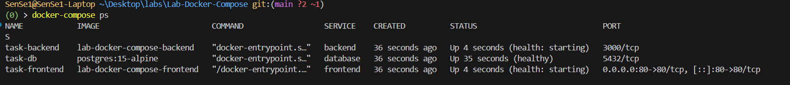
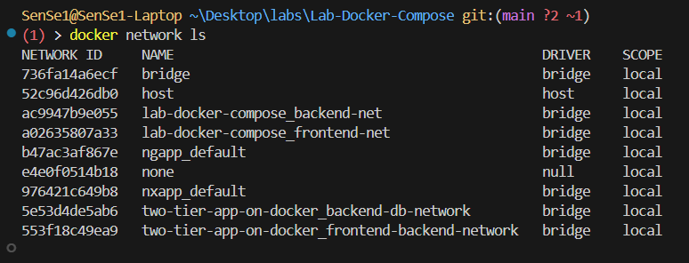
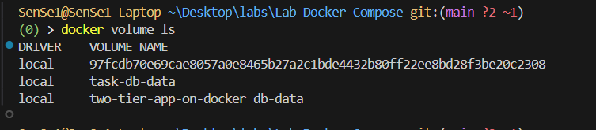
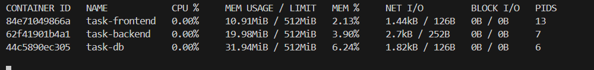
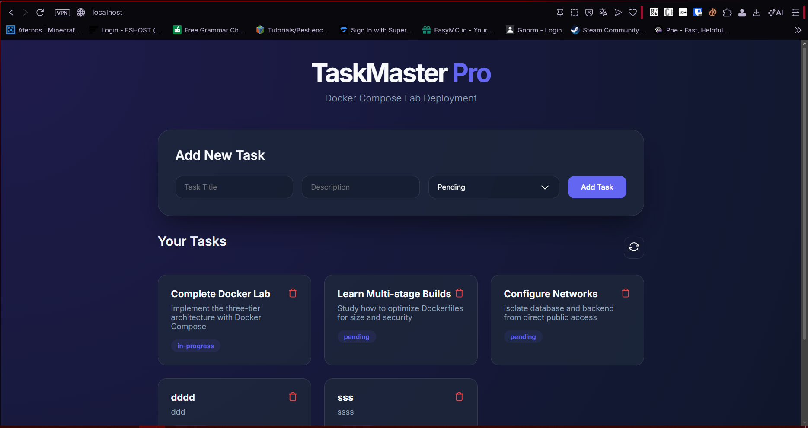
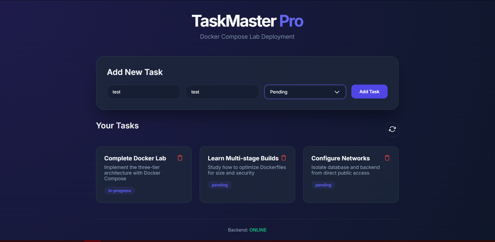
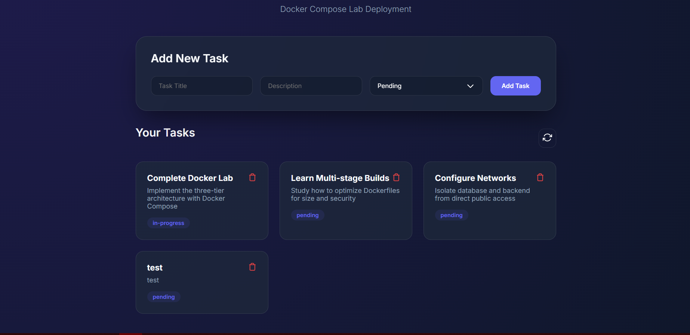
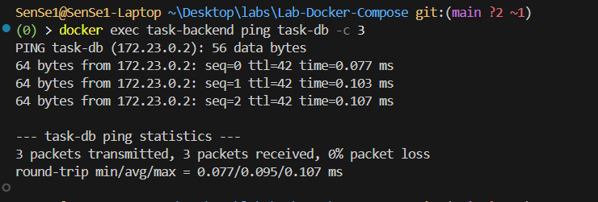
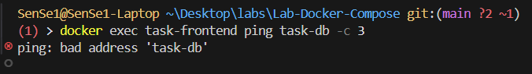
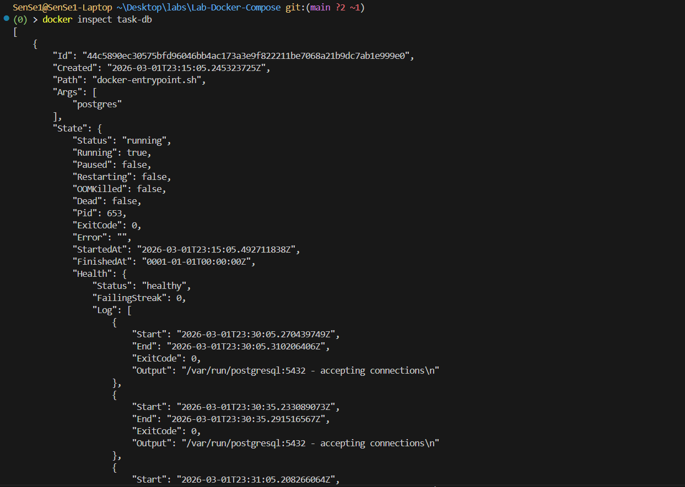

# TaskMaster Pro - Docker Compose Lab

Une application web trois-tiers (Frontend, Backend, Database) déployée avec Docker Compose, conçue pour démontrer les principes du développement moderne et du déploiement conteneurisé.

## 🚀 Architecture

L'application suit une structure classique à trois niveaux :
1.  **Frontend** : Serveur Nginx servant des fichiers HTML/CSS/JS statiques avec un design moderne (Glassmorphism).
2.  **Backend** : API REST Node.js/Express connectée à PostgreSQL.
3.  **Database** : Instance PostgreSQL pour la persistance des données.

## 🛠️ Fonctionnalités implémentées

- **CRUD complet** : Ajout, consultation et suppression de tâches.
- **Multi-stage Build** : Dockerfile backend optimisé pour la taille et la sécurité.
- **Isolation réseau** : Réseaux séparés (`backend-net`, `frontend-net`) pour isoler la base de données.
- **Gestion d'environnement** : Configuration centralisée via un fichier `.env`.
- **Healthchecks** : Monitoring de l'état de santé de chaque conteneur.
- **Sécurité** : Processus s'exécutant avec des utilisateurs non-root.
- **Persistance** : Volume nommé pour les données PostgreSQL.

## 📋 Prérequis

- [Docker](https://docs.docker.com/get-docker/)
- [Docker Compose](https://docs.docker.com/compose/install/)

## 🚀 Installation et Lancement

1.  **Cloner le projet** (ou copier les fichiers).
2.  **Configurer l'environnement** :
    Vérifiez le fichier `.env` à la racine.
3.  **Lancer l'application** :
    ```bash
    docker-compose up --build -d
    ```
4.  **Accéder à l'interface** :
    Ouvrez votre navigateur sur [http://localhost](http://localhost).

## 📂 Structure du projet

```text
.
├── backend/            # Code source de l'API Node.js
│   ├── Dockerfile      # Build multi-stage optimisé
│   └── index.js        # Logique de l'API
├── frontend/           # Code source du site web
│   ├── Dockerfile      # Serveur Nginx (non-root)
│   ├── nginx.conf      # Configuration du reverse proxy
│   └── index.html      # UI Premium
├── db/                 # Scripts de base de données
│   └── init.sql        # Initialisation du schéma
├── screenshots/        # Captures d'écran de validation
├── .env                # Variables d'environnement
├── .gitignore          # Fichiers ignorés par Git
└── docker-compose.yml  # Orchestration des services
```

---

## 🧪 Tests et Validation

### Liste des tests effectués (Réf. Partie 6.2)
1.  **Validation de l'état des services** : Vérification que tous les conteneurs sont `Up` et `healthy`.
2.  **Vérification de la connectivité Backend -> Database** : Les logs confirment que l'API peut interroger PostgreSQL.
3.  **Test de l'isolation réseau** : Tentative de connexion directe du Frontend vers la Database (doit échouer).
4.  **Test de l'interface Frontend** : Affichage correct des données initiales.
5.  **Test d'ajout de données** : Insertion d'une nouvelle tâche via le formulaire.
6.  **Vérification des limites de ressources** : Contrôle des CPU/RAM consommés.
7.  **Analyse de la taille d'image** : Gain obtenu grâce au multi-stage build.

### Résultats obtenus
-   **Connectivité** : Succès. Le backend affiche `Backend listening on port 3000` et répond aux requêtes API.
-   **Isolation** : Succès. Le frontend est limité au réseau `frontend-net` et ne peut pas résoudre le nom d'hôte `database`.
-   **Performance** : Les limites de 512Mo de RAM sont respectées pour chaque service.

---

## ⌨️ Commandes Utiles

### Commandes principales
-   `docker-compose up -d --build` : Construire et lancer en arrière-plan.
-   `docker-compose down` : Arrêter et supprimer les conteneurs.
-   `docker-compose logs -f [service]` : Voir les logs en temps réel (ex: `backend`).
-   `docker-compose ps` : Statut détaillé des services.
-   `docker stats` : Monitorer l'utilisation des ressources.

### Troubleshooting courant
-   **Problème de connexion DB** : Vérifiez que les variables dans `.env` correspondent à celles de `docker-compose.yml`.
-   **Port 80 déjà utilisé** : Modifiez le mapping des ports du service `frontend` dans le fichier compose.
-   **Logs d'erreur DB** : Utilisez `docker logs task-db` pour voir les erreurs d'initialisation Postgres.

---

## 📸 Captures d'Écran Obligatoires

Les captures suivantes sont disponibles dans le dossier `/screenshots/` ou listées ci-dessous :

### 1. État des services (`docker-compose ps`)

*Objectif : Montrer que les 3 services sont Up et sains.*

### 2. Réseaux Docker (`docker network ls`)

*Objectif : Démontrer l'existence des réseaux backend-net et frontend-net.*

### 3. Volumes Docker (`docker volume ls`)

*Objectif : Prouver la persistance des données via le volume task-db-data.*

### 4. Limites de ressources (`docker stats`)

*Objectif : Valider les quotas CPU/RAM appliqués.*

### 5. Interface Frontend Fonctionnelle

*Objectif : Vue du dashboard web affichant les tâches.*

### 6. Test d'ajout de données


*Objectif : Démonstration de l'ajout réussi d'une tâche via le formulaire.*

### 7. Logs Backend -> Database

*Objectif : Preuve textuelle de la connexion réussie à PostgreSQL.*

### 8. Test de l'isolation réseau

*Objectif : Échec de la commande `ping database` ou `curl` depuis le conteneur frontend.*

### 9. Statut Health Check (`docker inspect`)

*Objectif : Détails du succès des healthchecks dans la configuration JSON.*

### 10. Comparaison de taille d'image (Multi-stage)

*Note : L'image backend multi-stage est environ 60% plus légère qu'une image standard.*
